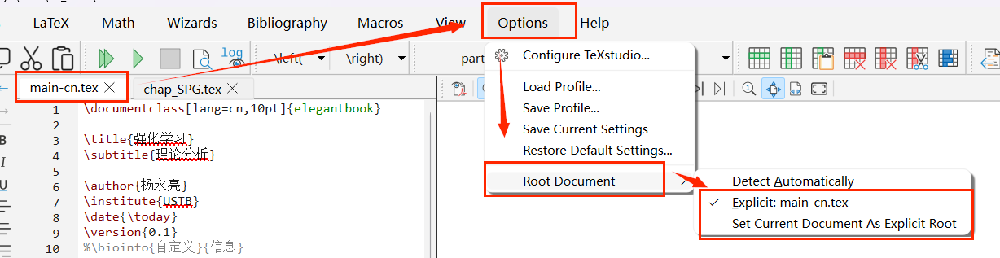

在 LaTeX 复杂项目中，出现文件包含情况，例如 main.tex 文档包含多个章节，我们可以不同章节设置单独 tex 文档 (例如 chap_1.tex)，那么在 main.tex 文档中使用如下命令进行文件包含：

```tex
\input{chap_1.tex}
```

然后每次修改 `chap_1.tex` 文档，都需要重新编译 `main.tex` 文档，这样会比较麻烦。

为了解决这个问题，我们可以通过以下设置，简化操作 (即修改 `chap_1.tex` 后，点击编译按钮，实现编译 `main.tex`)：

- 确保当前打开的文件是 main.tex
- `Options` -> `Root Document`
- 然后选择以下两个选项均可（可能只会有第二个选项）
  - `Explicit: main.tex`
  - `Set Current Document As Explicit Root`
做好上面设置后，`main.tex` 就被设置为项目的 `根文件`，每次修改 `chap_1.tex` 后，点击编译按钮，就会自动编译 `main.tex` 文档。

<!--  -->

