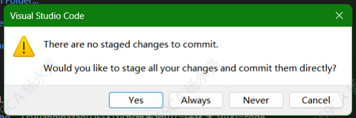
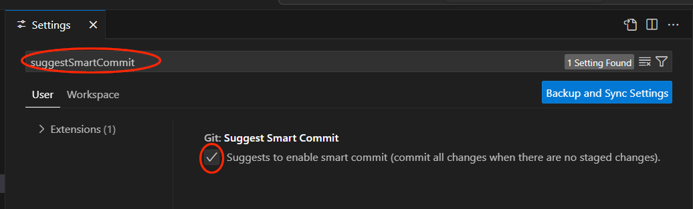

## 使用 vs code 的 source control 功能时，会有如下提示

## 误点 Never 后，这个提示框会消失，怎么恢复？

### 解决方案：

1. 打开 VS Code 设置（Ctrl + ,）。
2. 在搜索栏输入 git.suggestSmartCommit。
3. 勾选 "Git: Suggest Smart Commit" 选项（如图所示）。
4. 关闭设置窗口，VS Code 会自动保存。

